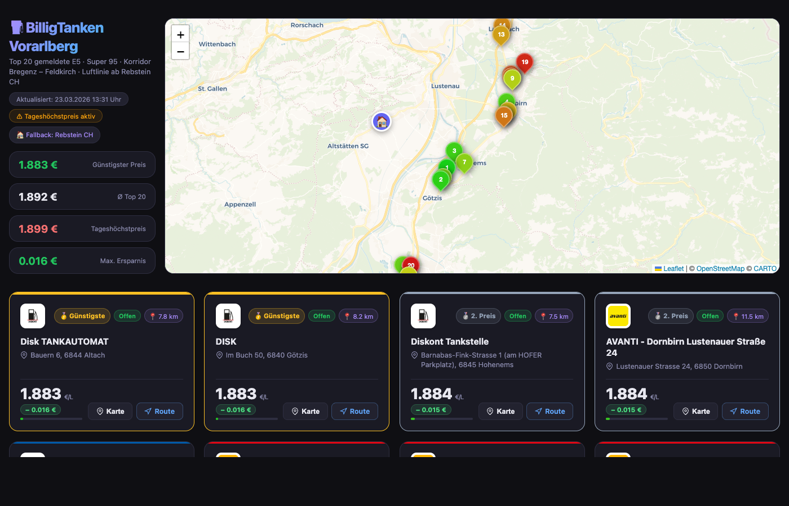

# ⛽ BilligTanken

Echtzeit-Übersicht der günstigsten **E5 (Super 95)** und **Diesel** Tankstellen in mehreren österreichischen Regionen, mit interaktiver Karte, GPS-Standort und Luftlinien-Entfernung.



## Regionen

| Region | Script | Referenzpunkt | API | Cron |
|--------|--------|---------------|-----|------|
| Wien – Alterlaa | `billigtanken-alterlaa.py` | Alterlaa | E-Control (AT) | `:00` |
| Innsbruck | `billigtanken-innsbruck.py` | Innsbruck | E-Control (AT) | `:15` |
| Vorarlberg (Bregenz – Feldkirch) | `billigtanken-vorarlberg.py` | Rebstein CH | E-Control (AT) | `:30` |
| Schärding / OÖ | `billigtanken-schaerding.py` | Schärding | E-Control (AT) | `:45` |
| Fürstenfeldbruck / Bayern 🇩🇪 | `billigtanken-ffb.py` | FFB Bahnhof | Tankerkönig (DE) | `:48` |

## Features

- **Top N günstigste Stationen** – sortiert nach Preis, bei Gleichstand nach Luftlinie vom Standort
- **Top 6 Schnellübersicht** – zeigt die 6 günstigsten unter den 20 nächstgelegenen Stationen
- **Benzin / Diesel Umschalter** – beide Kraftstofftypen in einer Seite, letzter Stand wird gespeichert
- **Interaktive Leaflet-Karte** – Marker farbcodiert von grün (günstig) → rot (teuer), klickbar
- **GPS-Standort** – Browser-Geolocation aktualisiert Entfernungen und Route-Links live
- **Route-Button** – öffnet Google Maps Directions direkt ab aktuellem Standort
- **Hell/Dunkel-Theme** – manuell umschaltbar, folgt System-Präferenz
- **Automatische Aktualisierung** – Cron stündlich, atomarer Datei-Swap (kein Flackern)
- Nur Stationen mit **gemeldeten Preisen** werden angezeigt

## Datenquellen

**Österreich** – [E-Control Austria](https://www.spritpreisrechner.at/) – gesetzlich verpflichtende Preistransparenzdatenbank.
In Österreich gilt ein staatlicher **Tageshöchstpreis** (Erhöhungen nur Mo/Mi/Fr um 12 Uhr). Diskont-Ketten (Disk, Avanti, JET) unterbieten ihn regelmäßig.

**Deutschland** – [Tankerkönig](https://creativecommons.tankerkoenig.de/) – MTS-K Daten der Bundesnetzagentur (E-Control Pendant).

> **Hinweis:** E10 wird in Österreich nicht verkauft. Das österreichische Äquivalent ist Super 95 (E5). In Deutschland sind E5, E10 und Diesel verfügbar.

## Quickstart

```bash
# Docker (empfohlen)
docker compose up -d --build
# → http://localhost:8080
```

```bash
# Lokal (eine Region, erzeugt HTML im aktuellen Verzeichnis)
pip install requests
python3 billigtanken-vorarlberg.py
open index-vorarlberg.html
```

## Docker

```bash
docker compose up -d --build   # starten / neu bauen
docker compose logs -f         # live logs (cron runs & errors)
docker compose down            # stoppen
```

| | |
|---|---|
| **Base Image** | `alpine:3.21` |
| **Image-Größe** | ~88 MB |
| **Web-Server** | Apache (httpd) |
| **Aktualisierung** | Cron, jede Stunde (stündlich um :00, :15, :30, :45 UTC) |
| **Port** | `8080` → Container `80` |
| **Log-Datei** | `/var/log/billigtanken.log` (gelöscht bei Neustart, ~200 Zeilen/Tag) |

## Konfiguration

Alle Einstellungen am Anfang des jeweiligen Regionalskripts:

| Variable | Bedeutung |
|---|---|
| `TOP_N` | Anzahl der angezeigten Kacheln |
| `QUERY_POINTS` | Koordinatenpunkte für die API-Abfrage |
| `HOME_LAT/LON/NAME` | Referenzpunkt für Luftlinien-Berechnung |
| `LAT/LON_MIN/MAX` | Bounding Box (filtert API-Ergebnisse) |
| `WEB_ROOT` | Ausgabeverzeichnis (Env-Variable, Standard: `.`) |

## Architektur

```
billigtanken_lib.py          ← gemeinsame Bibliothek (API, HTML-Generierung)
billigtanken-vorarlberg.py   ← Regionalkonfiguration + main()
billigtanken-alterlaa.py
billigtanken-innsbruck.py
billigtanken-schaerding.py
entrypoint.sh                ← startet alle Skripte einmalig, dann cron + Apache
```

## Aktuelle Updates (2026-03-30)

✅ **Cron Schedule Fix** – Printf-Bug behoben: alle 5 regionalen Scripts laufen jetzt auf Schedule (:00, :15, :30, :45, :48)

✅ **Logfile Optimierung** – Startup-Ausgabe zu `/dev/null` umgeleitet, Logdatei bei Neustart gelöscht → keine Bloatware mehr

✅ **FFB Integration** – Neue Region: Fürstenfeldbruck mit deutscher Tankerkönig API (MTS-K Daten der Bundesnetzagentur)

✅ **Status Line** – Claude Code zeigt jetzt `hostname:dir | model | ctx%` (inspiriert von Debian PS1)
